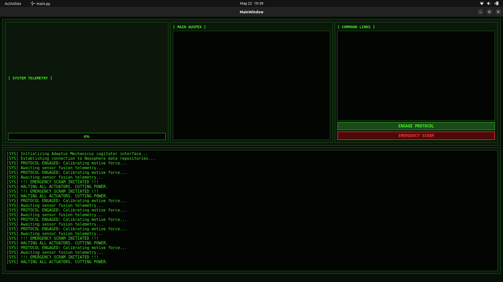

# ADEPTUS MECHANICUS TERMINAL

A grimdark industrial telemetry dashboard built with PySide6 and Qt Designer.

Inspired by:
- Warhammer 40K machine terminals
- industrial HMI systems
- robot operator consoles
- retro-futuristic telemetry displays

## Preview



## Features

- Telemetry monitoring panel
- Command interface
- Emergency system controls
- Real-time terminal logs
- Modular Qt layout system
- Sci-fi industrial theme

## Installation

```bash
pip install -r requirements.txt
python src/main.py

